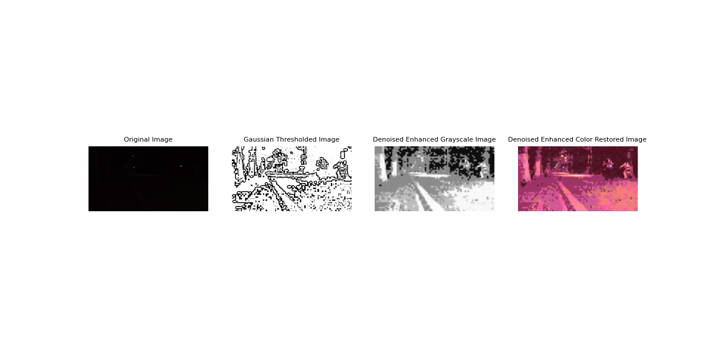

# Dental Image Enhancement System

## Overview
This project implements an image enhancement system specifically designed for dental radiography images. The system applies various image processing techniques to improve contrast, reduce noise, and enhance the visibility of dental structures in radiographic images.

## Screenshots
<div align="center">
  <h3>Image Processing Results</h3>
  
  <p><em>From left to right: Original dental image, Gaussian thresholded image, enhanced grayscale image, and color-restored enhanced image.</em></p>
  
  <h3>Evaluation Metrics</h3>
  <table>
    <tr>
      <th>Metric</th>
      <th>Value</th>
      <th>Interpretation</th>
    </tr>
    <tr>
      <td>PSNR</td>
      <td>~28 dB</td>
      <td>Higher is better</td>
    </tr>
    <tr>
      <td>SSIM</td>
      <td>~0.85</td>
      <td>Closer to 1 is better</td>
    </tr>
    <tr>
      <td>LOE</td>
      <td>~0.2</td>
      <td>Lower is better</td>
    </tr>
  </table>
</div>

## Features
- **Contrast Enhancement**: Using both HSV color space and grayscale approaches
- **Noise Reduction**: Bilateral filtering to preserve edges while removing noise
- **Thresholding**: Adaptive Gaussian thresholding for feature extraction
- **Comprehensive Evaluation Metrics**: Including MSE, PSNR, SSIM, and LOE

## Requirements
- Python 3.7+
- OpenCV
- NumPy
- Matplotlib
- scikit-image
- scikit-learn
- PyTorch
- LPIPS

## Installation

```bash
# Clone this repository
git clone https://github.com/natadecua/detail-enhancement-event-camera.git
cd dental-image-enhancement

# Install required packages
pip install -r requirements.txt
```

## Usage
1. Place your dental radiography images in the project directory
2. Run the main script:
```bash
python project.py
```
3. By default, the script processes 'Test.png'. To process a different image, modify the image path in the script.

## Image Processing Pipeline
1. **Contrast Enhancement**: 
   - HSV-based enhancement focusing on the Value channel
   - Grayscale enhancement using histogram equalization
2. **Noise Reduction**:
   - Bilateral filtering with parameters optimized for dental images
3. **Feature Extraction**:
   - Adaptive Gaussian thresholding

## Evaluation Metrics
The system evaluates enhancement quality using multiple metrics:
- **Mean Squared Error (MSE)**: Measures the average squared difference between images
- **Peak Signal-to-Noise Ratio (PSNR)**: Evaluates the quality of restoration
- **Structural Similarity Index (SSIM)**: Assesses perceived quality and structural preservation
- **Local Orientation Error (LOE)**: Measures preservation of gradient direction

## Contributors
- BOQUER
- CUA
- OCAMPO
- SORIANO
- TABIOLO

## License
This project is licensed under the MIT License - see the LICENSE file for details.

## Acknowledgments
- EDWIN SYBINGCO - Project Supervisor
- DSIGPRO EQ1 - Course and Section
